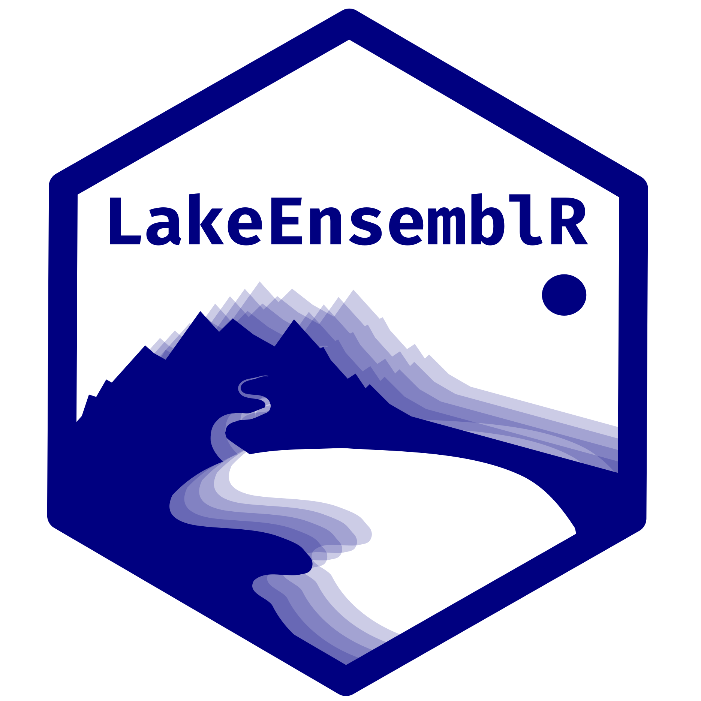

# Hydrodynamic and ensemble lake modelling

<a href="url"></a>

------------------------------------------------------------------------

:spiral_calendar: October 13, 2022
:alarm_clock: 9:00-13:00 
:busts_in_silhouette: Tom Shatwell, Karsten Rinke 
:computer: [Material](https://github.com/shatwell/LakeEnsemblR_intro)
:octocat: [Homepage](https://github.com/aemon-j/LakeEnsemblR)
:page_facing_up: [OA journal article on the LakeEnsemblR R-package](https://doi.org/10.1016/j.envsoft.2021.105101)


------------------------------------------------------------------------

## Description

This training module will provide an introduction into lake 
hydrodynamic modelling. After a short introductory presentation 
we will apply the 1D lake model [FLake](http://www.flake.igb-berlin.de/)
to an example waterbody. After learning how to apply one hydrodynamic model, 
we will dive into ensemble modelling with the [R package
"LakeEnsemblR"](https://github.com/aemon-j/LakeEnsemblR) that has been
developed within the GLEON modelling group. Learn how to set up multiple
lake models for your lake physical system, how to calibrate your models
and explore model uncertainty. 


## What will this workshop cover?

* Introduction to hydrodynamic modelling of lakes

* Introduction to the FLake model

* Introduction to LakeEnsemblR package: 
    - Why use ensembles? 
    - What is LakeEnsemblR?

* Using LakeEnsemblR: 
    - Standardisation of input data 
    - Functions 
    - Visualising output & calibration 
    - Apply it to YOUR lake! (or on OUR examples)

## Prerequisites

### 1. Install the required software

In this workshop, you will need [R](https://www.r-project.org/) (version>=3.5) and a GUI of your choice (preferably
[RStudio](https://www.rstudio.com/products/rstudio/download/) - desktop
free version). You will also need a decent text editor (e.g.
[Notepad++](https://notepad-plus-plus.org/downloads/)) and netcdf viewer
like PyNcView. Windows users can download PyNcView for example
[here](https://getwinpcsoft.com/PyNcView-2257247/). Linux users can
install PyNcView via [PyPi](https://pypi.python.org/pypi), then with the
command ```pip install pyncview```. Mac users, try to find a download on the web, or email me
at tom.shatwell@ufz.de.

### 2. Set up the FLake hydrodynamic model

Clone or download files from this Github repository to a local directory on your computer. 
Keep the file structure as it is. That should be all you have to do! 

#### Optional: 
If you would like to compile the model yourself and have the gfortran compiler on your system,
then follow these steps:

  1. On your computer, navigate to /path/to/LakeEnsemblR_intro/flake/sources/ and then
    run the file "makeflake_win.bat" on Windows, "makeflake_linux.sh" on linux, or "makeflake_mac.sh" on macOS. 
    This should create an executable file in the "sources" directory called ```flake.exe``` on win, 
    ```nixflake``` on linux, or ```macflake``` on macOS.
    
  2. Move the executable file you just created from the "LakeEnsemblR_intro/flake/sources" directory 
  up one level to /LakeEnsemblR_intro/flake/ and replace the existing executable with the same name.


### 3. Set up the LakeEnsemblR R-package 

This step can take a while, so rather do it in advance of the training. 
To set up LakeEnsemblR, first open R or your IDE like RStudio. Then install the "remotes", "ggplot2", "ggpubr" and "reshape" 
packages by entering the following commands into the console.
```
install.packages("remotes")
install.packages("ggplot2")
install.packages("ggpubr")
install.packages("reshape")
```
Next, install the specific LakeEnsemblR packages from github. 

#### Windows and Linux users:
```
remotes::install_github("GLEON/rLakeAnalyzer")
remotes::install_github("aemon-j/GLM3r", ref = "v3.1.1")
remotes::install_github("USGS-R/glmtools", ref = "ggplot_overhaul")
remotes::install_github("aemon-j/FLakeR", ref = "inflow")
remotes::install_github("aemon-j/GOTMr")
remotes::install_github("aemon-j/gotmtools")
remotes::install_github("aemon-j/SimstratR")
remotes::install_github("aemon-j/MyLakeR")
remotes::install_github("aemon-j/LakeEnsemblR")
```


#### macOS users:
```
remotes::install_github("GLEON/rLakeAnalyzer")
remotes::install_github("aemon-j/GLM3r", ref = "macOS")
remotes::install_github("USGS-R/glmtools", ref = "ggplot_overhaul")
remotes::install_github("aemon-j/FLakeR", ref = "macOS")
remotes::install_github("aemon-J/GOTMr", ref = "macOS")
remotes::install_github("aemon-j/gotmtools")
remotes::install_github("aemon-j/SimstratR", ref = "macOS")
remotes::install_github("aemon-j/MyLakeR")
remotes::install_github("aemon-j/LakeEnsemblR")
```

Unfortunately, the macOS version of GLM will differ to the one included in the executables for Windows and Linux. GLM on macOS will be version 3.2.0a8 (most recent on January 13, 2022), Windows/Linux use 3.1.1.


### 4. Check that your setup is working

Open RStudio (for instance by double-clicking the file ```LakeEnsemblR_intro.Rproj```), 
and then run the test script ```test_BEFORE_workshop.R```.

If you ran the script to the end without errors, congratulations, everything looks good.
If you encountered errors

## Files

### Workshop Files 

The HTML and PDF files in the repository both
contain the information needed for the workshop. You can pick which one
you prefer. You can copy the code into an R script and run it yourself,
or use the pre-made R script ("InventWater_LakeEnsemblR.R"), which
contains all the lines of code that are run during the workshop and some
short comments.

### LakeEnsemblR Examples 

There is a selection of lakes of different
areas, depths and climatic zones that have been collated to show you
different applications of ```LakeEnsemblR```. They can be downloaded from
the [LER_examples](https://github.com/aemon-j/LER_examples) repository
on the "aemon-j" GitHub account.


## Acknowledgement

The workshop material on LakeEnsemblR, including the nice presentation and structure
in this github repo, was developed by the LakeEnsemblR core
developers Jorrit Mesman, Johannes Feldbauer, Tadhg Moore, and Robert
Ladwig. It was presented at GLEON21.5 in the GSA workshop series. We are
very grateful for their help. 

:computer: [Original LakeEnsemblR GSA workshop material](https://github.com/shatwell/LakeEnsemblR_intro)


------------------------------------------------------------------------
